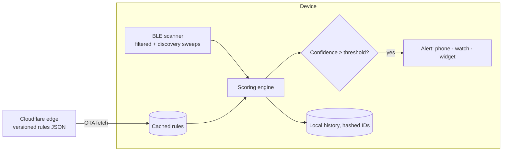

# Architecture

## Key decisions

| Decision | Why |
|---|---|
| Hybrid scan: hardware-filtered scanning plus short unfiltered sweeps | Filtered scans keep working in the background, and sweeps catch brands that only show up by name |
| Rules served from the edge, cached on device | Detection improves without app releases, and the app keeps working offline |
| Weighted confidence instead of a yes/no match | BLE signals are noisy, so scoring lets each user trade false alarms against missed detections |
| Fully native per platform (Kotlin/Compose, Swift/SwiftUI) | Background BLE behavior differs between platforms and needs native control |
| On-device only, hashed identifiers | No tracking backend, which means less risk and easier store review |

## Known limits, stated honestly

Passive BLE can't confirm a camera is actually recording. Devices that don't advertise, or that randomize their identifiers, may be missed. The app shows likelihood, not proof.
